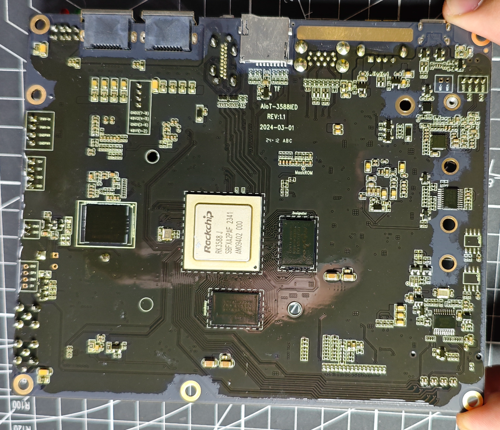
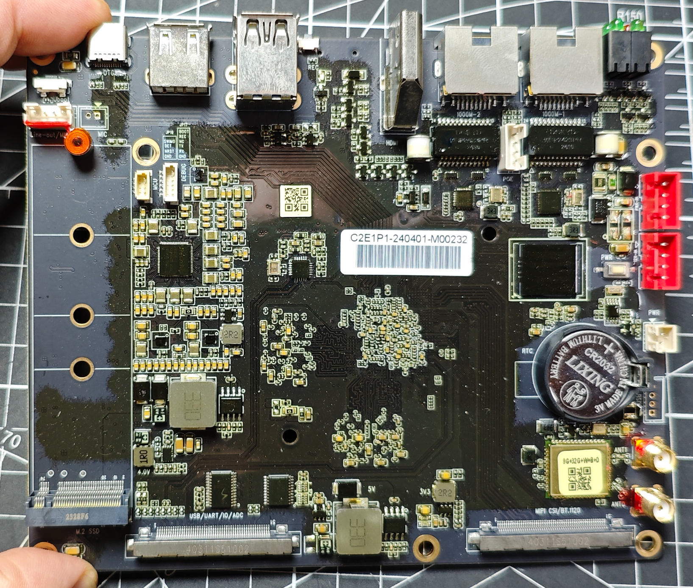
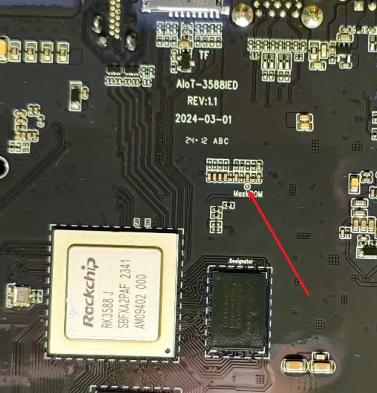
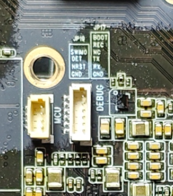

# 视美泰AIoT-3588IED适配

## 目录

* [硬件规格](docs/硬件规格.md)
* [固件列表](docs/固件列表.md)
* [刷机指引](docs/刷机指引.md)
  * [ophub armbian](docs/刷机指引/ophub_armbian.md)
  * [ophub 飞牛](docs/刷机指引/ophub_fnos.md)
  * [ophub openwrt](docs/刷机指引/ophub_openwrt.md)
  * [android12固件](docs/刷机指引/android12.md)
  * [android13固件](docs/刷机指引/android13.md)
  * [android14固件](docs/刷机指引/android14.md)
* [适配记录](docs/适配记录.md)
  * [原厂固件修改](docs/适配记录/原厂固件修改.md)
  * [uboot v2017](docs/适配记录/uboot2017.md)
  * [uboot v2026](docs/适配记录/uboot2026.md)
  * [recovery](docs/适配记录/recovery.md)
  * [android12适配](docs/适配记录/android/android12.md)
  * [android13适配](docs/适配记录/android/android13.md)
  * [android14适配](docs/适配记录/android/android14.md)
  * [edk2 uefi适配](docs/适配记录/edk2_uefi.md)
* [外壳机箱](docs/外壳机箱.md)
* [需求清单](docs/需求清单.md)

## 参数规格

## 相关链接

## maskrom短接点、TTL、硬盘电源

- maskrom短接点：

在CPU旁边，将MASKROM点位于TF卡铁壳表面短接即可

- debug调试口

主板正面，有丝印

## 内核适配进度

| 仓库地址 | 分支 | 适配进度 | 备注 |
| :--- | :--- | :--- | :--- |
| `https://github.com/ophub/linux-6.18.y.git` | `ophub_6.18.y` | 🔄 进行中 | 适配中 |
| `https://github.com/rockchip-linux/kernel.git` | `develop-6.1` | 🔄 进行中 | 适配中 |
| `https://github.com/rockchip-linux/kernel.git` | `develop-6.6` | 🔄 进行中 | 适配中 |
| `https://github.com/ophub/linux-6.1.y-rockchip` | `linux-6.1.y-rockchip` | 🔄 进行中 | 适配中 |
| `https://atomgit.com/openeuler/kernel` | `OLK-6.6` | 🔄 进行中 | 适配中 |
| `https://mirrors.cernet.edu.cn/linux-stable.git` | `master` | 🔄 进行中 | 适配中 |
| `https://github.com/ophub/ophub_6.1.y` | `master` | 🔄 进行中 | 适配中 |
| `https://github.com/ophub/ophub_6.6.y` | `master` | 🔄 进行中 | 适配中 |
| `https://github.com/ophub/ophub_6.12.y` | `master` | 🔄 进行中 | 适配中 |

---

## 免责申明

- 本仓库所提供的内容均基于公开、合法渠道整理，仅供用户参考与学习之用。
- 严格遵守国家相关法律法规，尊重并保护个人隐私及知识产权。
- 如您认为相关内容涉及您的隐私、版权或其他合法权益，请及时联系，将依法核实并在必要时予以删除或下架。
- 对于因使用或无法使用本网站/平台内容所引发的任何直接或间接损失，不承担任何法律责任。
- 用户在使用过程中应自行判断信息的适用性，并承担相应风险。

